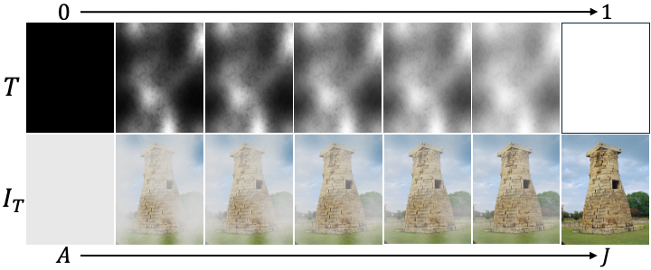

<!-- Using HTML to center the abstract -->
<div class="columns is-centered has-text-centered">
    <div class="column is-four-fifths">
        <h2>Abstract</h2>
        <div class="content has-text-justified">
Dehazing involves removing haze or fog from images to restore clarity and improve visibility by estimating atmospheric scattering effects. 
While deep learning methods show promise, the lack of paired real-world training data and the resulting domain gap hinder generalization to real-world scenarios.
In this context, physics-grounded learning becomes crucial; however, traditional methods based on the Atmospheric Scattering Model (ASM) often fall short in handling real-world complexities and diverse haze patterns.
To solve this problem, we propose HazeFlow, a novel ODE-based framework that reformulates ASM as an ordinary differential equation (ODE). 
Inspired by Rectified Flow (RF), HazeFlow learns an optimal ODE trajectory to map hazy images to clean ones, enhancing real-world dehazing performance with only a single inference step. 
Additionally, we introduce a non-homogeneous haze generation method using Markov Chain Brownian Motion (MCBM) to address the scarcity of paired real-world data. 
By simulating realistic haze patterns through MCBM, we enhance the adaptability of HazeFlow to diverse real-world scenarios. 
Through extensive experiments, we demonstrate that HazeFlow achieves state-of-the-art performance across various real-world dehazing benchmark datasets.
        </div>
    </div>
</div>

---
<div style="text-align: center;">
  
</div>
---

## Key Ideas 
<div style="text-align: center;">
  
</div>

Illustration of dehazing trajectory of hazy image $I_T$ as transmission map T gradually increases from 0 to 1.

--- 

##  Non-Homogeneous Haze Generation

<div style="text-align: center;">
  
</div>

## Architecture

<div style="text-align: center;">
  
</div>

Overview of our proposed method, illustrating (a) HazeFlow and (b) Transmission Network.
Our HazeFlow consists of a U-Net and a T-Net.
The U-Net takes the hazy image and transmission map derived from the hazy image as inputs, while the T-Net processes the transmission map. 
Input transmission map T DCP is estimated using DCP [22]. T-Net then embeds the transmission feature, which is combined with the U-Net to predict the dehazed image.

## Results

<div style="text-align: center;">
  
</div>

## Citation
```
@article{shin2025hazeflow,
    title={HazeFlow: Revisit Haze Physical Model as ODE and Realistic Non-Homogeneous Haze Generation for Real-World Dehazing},
    author={Junseong Shin and Seungwoo Chung and Yunjeong Yang and Tae Hyun Kim},
    journal={ICCV},
    year={2025}
}
```
